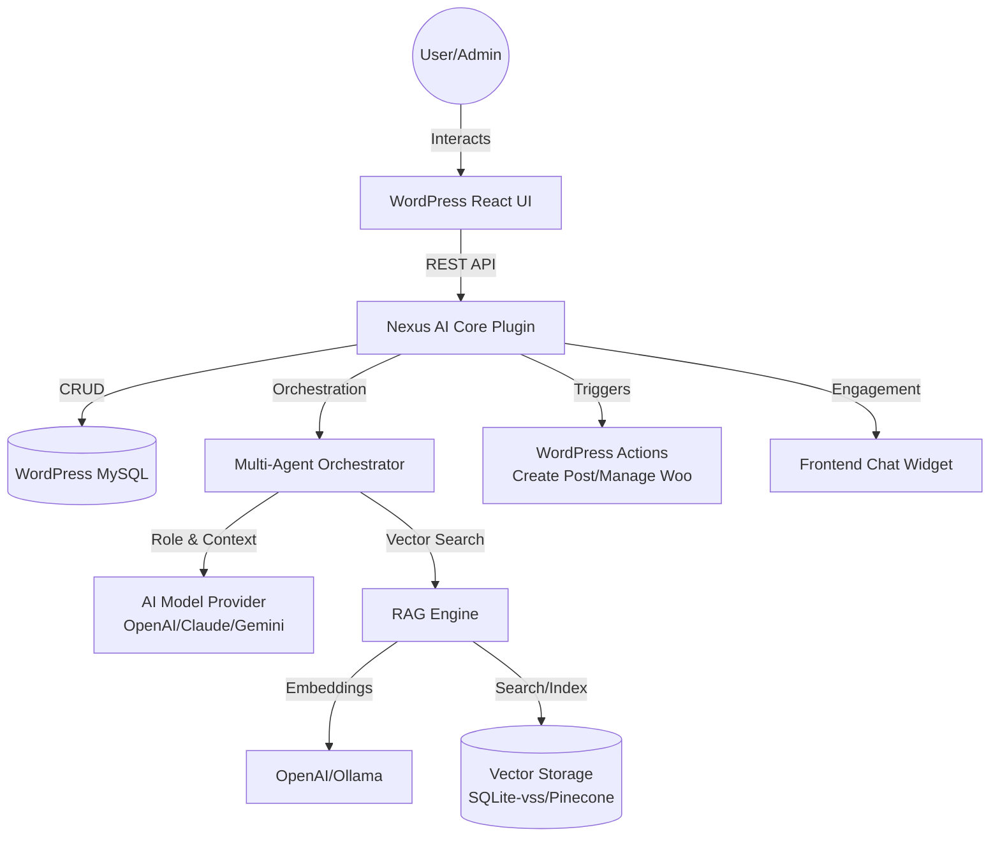

# System Architecture Overview - Nexus AI Workforce

## High-Level Diagram
Nexus AI Workforce operates as a bridge between the WordPress ecosystem and external AI Intelligence.

## Component Breakdown

### 1. WordPress Environment (The Host)
- **Nexus AI Core:** The main PHP engine managing security, routing, and data persistence.
- **Hybrid UI:** PHP-rendered shells with an asynchronous JavaScript bridge for real-time interactions.
- **WP Database:** Stores employee profiles (30+ roles), 13-table enterprise schema, and audit logs.

### 2. AI Intelligence Layer (The Brain)
- **Model Adapters:** Abstracted interface to communicate with various LLMs (GPT-4o, Claude 3.5, etc.).
- **Orchestrator:** The logic that manages multi-agent interactions, task delegation, and state management.

### 3. Knowledge & Retrieval (The Memory)
- **RAG Engine:** Handles document ingestion, semantic chunking, and retrieval.
- **Vector Storage:** Efficient storage for high-dimensional data, enabling semantic search.

### 4. Integration Hub (The Hands)
- **Action Bus:** Allows the AI to perform tasks within WordPress (e.g., "Create a new draft post with this content").
- **External Webhooks:** Connects Nexus to Zapier, Make, and Slack.
