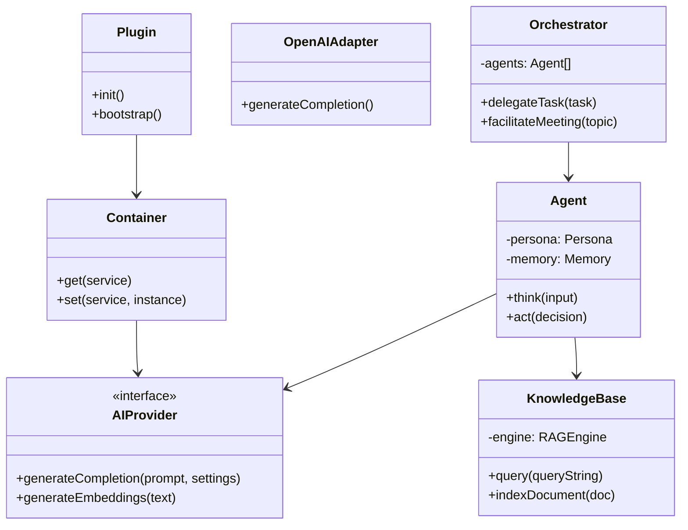

# UML & API Design - Nexus AI Workforce

## UML Class Diagram (Simplified)

## REST API Design
All endpoints prefixed with `/wp-json/nexus-ai/v1`.

### 1. Employees & Departments
- `GET /employees`: List all AI employees.
- `POST /employees`: Create a new AI employee.
- `GET /employees/{id}`: Get details of a specific employee.
- `PUT /employees/{id}`: Update employee settings.
- `GET /departments`: List all departments.

### 2. Conversations & Chat
- `GET /conversations`: Get user's conversation history.
- `POST /conversations`: Start a new conversation.
- `GET /conversations/{id}/messages`: Get messages in a conversation.
- `POST /conversations/{id}/messages`: Send a message to an employee.
- `POST /conversations/meeting`: Start a multi-agent meeting.

### 3. Knowledge Base
- `GET /kb`: List knowledge bases.
- `POST /kb/upload`: Upload a document for indexing.
- `GET /kb/search?q=...`: Test RAG search results.

### 4. Workflows
- `GET /workflows`: List available workflows.
- `POST /workflows/{id}/run`: Trigger a specific multi-agent workflow.

### 5. Analytics & Usage
- `GET /analytics/usage`: Get token usage and cost data.
- `GET /analytics/performance`: Get agent performance metrics.
